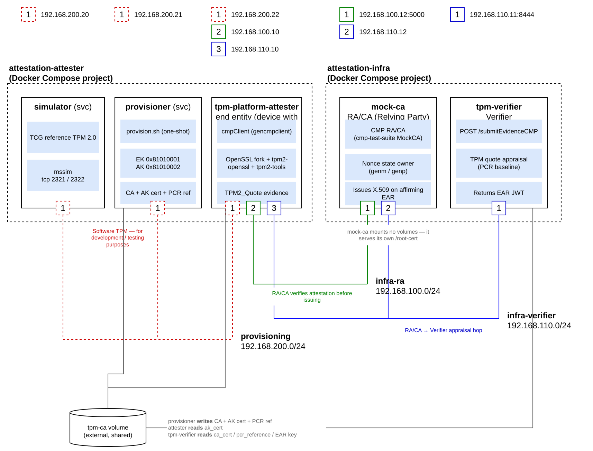

# Remote Attestation Demonstration Environment — TPM Platform Attestation

⚠️ This setup is intended for experimentation and demonstration purposes. It should not be taken as a reference for a production-ready security solution. ⚠️

This Docker-based virtual environment consists of two Docker Compose projects: the first
represents a **TPM-backed end entity** (a device with an Attester), the second the attestation
infrastructure. The end entity proves its platform state with a `TPM2_Quote` over the platform
PCRs; the infrastructure is a TPM attestation **Verifier** plus a MockCA-based CMP **RA/CA**
that issues an X.509 certificate only after the quote-based Evidence is appraised as affirming.

This demo uses attestation type **quote**, statement `TcgAttestQuote = 2.23.133.20.2`, request
OID `1.2.3.4.5`, and response OID `1.2.3.4.6`.

## What this demo proves

Ordinary CMP enrolment answers *"does the requester hold the private key?"* This demo adds a
second question the CA must be satisfied on before it will issue: **"what software state is
that machine actually in, right now?"**

Three roles from [RFC 9334](https://datatracker.ietf.org/doc/rfc9334/) (RATS) are played by
containers here. The naming follows
[draft-ietf-lamps-csr-attestation](https://datatracker.ietf.org/doc/draft-ietf-lamps-csr-attestation/),
which maps the RATS roles onto certificate issuance — PKI name first, RATS role second:

| PKI / CMP | RATS role | Container | Job |
|---|---|---|---|
| **end entity** | **device with Attester** | `tpm-platform-attester` | Owns the TPM. Produces *Evidence* — a `TPM2_Quote` signed by its Attestation Key (AK). |
| **RA/CA** | **Relying Party** | `mock-ca` | Issues the certificate **only** on an affirming verdict — and embeds the verdict in it. |
| — | **Verifier** | `tpm-verifier` | Appraises Evidence against a PCR baseline and returns a signed *Attestation Result* (an **EAR**). |

> **"Relying Party" here means the RA/CA**, not whoever validates the certificate afterwards.
> The draft is explicit that this *"use of the term 'relying party' differs from the
> traditional PKIX use of the term"*. This README says **certificate consumer** for the
> PKIX sense.

Two properties are worth watching for, because they are the whole point:

- **The nonce is issued by the RA/CA, never chosen by the end entity.** The end entity asks for
  a nonce (CMP `genm`), the RA/CA mints 32 random bytes and remembers them against the CMP
  transaction (`genp`). The TPM then signs *that* value into the quote as `qualifyingData`.
  A quote captured from an earlier boot cannot be replayed, because it embeds the wrong nonce.
- **The certificate carries the verdict.** The RA/CA embeds the Verifier's EAR into the issued
  X.509 under OID `1.7.6.5.123`, so a certificate consumer can later read *which* platform
  state was attested — not merely that somebody, once, said it was fine.

> **Note — privacy consideration:** In this demonstration, the MockCA deliberately embeds the
> EAR (the Attestation Result) in the issued certificate so that it can be inspected later. This
> may disclose platform-attestation information to anyone who can inspect the certificate and is
> therefore a privacy concern. Production deployments should assess this disclosure before
> including attestation results in certificates.

A **PCR quote** is the TPM reporting its Platform Configuration Registers: hash values that
can only ever be extended, never overwritten. Signed by the AK, they are a tamper-evident
statement of what the machine measured as it booted.

> The end entity never talks to the Verifier. The RA/CA does. That keeps the end entity's
> trust decisions out of its own hands.


## Deployment setup

The following figure illustrates the setup of the Docker-based virtual environment, showing the Compose projects, corresponding services, networks and addresses, and shared host volumes.



Architecture and workflow diagrams live in `figures/tpm-platform/`: the software stack
(`Software_stack.png`) and the protocol/message diagrams under `workflow/`:

| Figure | Shows |
|---|---|
| [`cmp-nonce-exchange`](./figures/tpm-platform/workflow/cmp-nonce-exchange.png) | The `genm`/`genp` round trip that issues the server-side nonce and the TPM quote parameters. |
| [`attester-evidence`](./figures/tpm-platform/workflow/attester-evidence.png) | `TPM2_Quote` over the selected PCRs and how the result becomes an `AttestationBundle`. |
| [`enrollment-appraisal`](./figures/tpm-platform/workflow/enrollment-appraisal.png) | The `ir` carrying the bundle, the RA/CA→Verifier appraisal, and the issued certificate. |

## Dependencies

The setup was developed and tested on Ubuntu-based systems. Make sure the following are available:

- Docker and Docker Compose. For Ubuntu, see the [corresponding installation instructions](https://docs.docker.com/engine/install/ubuntu/).
- `curl`

Nothing needs to be checked out by hand: every image clones its pinned public
GitHub branch during `docker build`.

| Source | Branch | Used by | Pinned as |
|--------|--------|---------|-----------|
| [`openssl`](https://github.com/Guiliano99/openssl) | `demo/docker_RATS2_OLD_V9` | attester | `ARG OPENSSL_BRANCH` |
| [`gencmpclient`](https://github.com/Guiliano99/gencmpclient) | `demo/docker_RATS2_TPMV4_COSE` | attester | `ARG GENCMPCLIENT_BRANCH` |
| [`libattest-py`](https://github.com/Guiliano99/libattest-py) | `UpdateV8_1` | attester, MockCA, Verifier | `ARG LIBATTEST_BRANCH` |
| [`cmp-test-suite-update-code`](https://github.com/Guiliano99/cmp-test-suite-update-code) | `AddInitRemoteAttestation` | MockCA | hardcoded in the `RUN` |

The `ARG` pins can be overridden per build (`docker compose build --build-arg
LIBATTEST_BRANCH=…`); the MockCA's branch needs a Dockerfile edit. Keep the three
libattest users on one branch — the Verifier must appraise exactly what the attester
produces, so a split is a wire-contract hazard.

No physical TPM is needed: the demo runs the TCG reference TPM 2.0 **simulator** in a
container. Everything is local — nothing is sent off the machine.

**What to budget:** the first `make start-attestation-attester` is the slow part — it compiles
the OpenSSL fork and gencmpclient from source, so expect **several minutes** and a few GB of
image layers. Everything after that is fast: the containers start in seconds, and a single
enrolment (`make request-certificate`) takes about **3 seconds**.

Run `make help` at any time to list the available targets.

## Start the attester and infrastructure Compose projects

Initially (i.e., after booting the system), create the required networks / bridges and the
shared `tpm-ca` volume once:

```bash
make setup            # or, equivalently: ./scripts/configure-network.bash
```

The stack is two separate Compose projects, and each target follows its project's logs — so
give each one its own console.

In a first console, bring up the end entity side:

```bash
make start-attestation-attester    # simulator + provisioner + attester
```

This starts the TPM `simulator`, runs the one-time `provisioner` (which creates the EK/AK and the
CA, written to the `tpm-ca` volume), and then leaves the `tpm-platform-attester` container running
and idle, ready to enrol on demand.

In a second console, bring up the infrastructure:

```bash
make start-attestation-infra       # Verifier + RA/CA
```

This starts the `tpm-verifier` (`192.168.110.11:8444`) and the `mock-ca` (`192.168.100.12:5000`).

If you would rather not tie up two consoles, `make start` runs `make setup` and brings both
projects up detached in one command.

The start order is not critical: the Verifier reads the trust-anchor CA
(`/tpm-ca/ca_cert.pem`) freshly on each appraisal, so it picks up the provisioner's
CA whether the infra or the attester project comes up first.

## Requesting a certificate using remote attestation

With both Compose projects running, enrol from a third console:

```bash
make certificate
```

That runs the guided walkthrough (`/app/request-certificate.bash`) inside the running attester
container (`make request-certificate` is a compatibility alias for it). For automation use
`make test-submit` instead — it drives the separate non-interactive enrolment driver and
asserts a certificate was issued, so CI never hits the walkthrough's ENTER prompts.

The end entity requests a nonce from the RA/CA over CMP, generates a fresh TPM-resident subject
key, builds a `TPM2_Quote` over the platform PCRs signed by the AK (statement `TcgAttestQuote`,
`2.23.133.20.2`), and sends a CSR carrying that Evidence. The RA/CA forwards the Evidence to the
Verifier; on an affirming appraisal it issues the certificate (with the Attestation Result
embedded under `EAR_OID` `1.7.6.5.123`). The issued certificate is written to
`attestation-attester/tpm-platform-attest/output/enrolled.pem`.

The walkthrough pauses at each step with `Press <ENTER>`, printing a framed banner explaining
what is about to happen. It takes about 3 seconds of actual work.

### What you should see

The walkthrough prints six steps. The interesting one is *"Submit nonce-bound TPM evidence"*,
where the protocol becomes visible — this is a real, unedited excerpt:

```text
cmpClient INFO: Configured TPM NonceRequest: type=1.2.3.4.5, hash proposal 0x000B (SHA-256)
cmpClient INFO: Expecting TPM quote NonceResponse: type=1.2.3.4.6
cmpClient INFO: sending GENM
cmpClient INFO: received GENP
cmpClient INFO: getTPMAttestExtNative: RATS nonce on CTX (32B) — used as TPM2_Quote.qualifyingData
cmpClient INFO: getTPMAttestExtNative: using verifier-supplied PCR selection from NonceResponse.respInfo (5 PCR(s))
cmpClient INFO: tpm_ops: Quoting verifier-selected PCRs: sha256 (5 indices)
cmpClient INFO: getTPMAttestExtNative: TPM2_Quote produced 145-byte TPMS_ATTEST, 262-byte TPMT_SIGNATURE
cmpClient INFO: Generated TcgAttestQuote (OID 2.23.133.20.2):
cmpClient INFO:   tpmSAttest:
cmpClient INFO:     magic=0xff544347, type=0x8018
cmpClient INFO:     extraData (server-issued nonce) (32 bytes): 15:F4:84:9F:EE:07:EB:92:...
cmpClient INFO:     pcrSelect[0]: hashAlg=0x000b
cmpClient INFO:     pcrDigest (32 bytes): B3:93:97:88:42:A0:FA:3D:...
cmpClient INFO:   signature: TPMT_SIGNATURE scheme=0x0014 (262 bytes)
cmpClient INFO: getTPMAttestExtNative: built bundle with TcgAttestQuote (1433 bytes DER) as CSR extension 1.2.840.113549.1.9.16.2.59
cmpClient INFO: sending IR
cmpClient INFO: received IP
cmpClient INFO: received from 192.168.100.12:5000 PKIStatus: accepted
cmpClient INFO: storing 1 certificate of newly enrolled certificate and chain in file '/output/enrolled.pem'
```

Read that against the workflow figures: `GENM`/`GENP` is
[`cmp-nonce-exchange`](./figures/tpm-platform/workflow/cmp-nonce-exchange.png), the quote is
[`attester-evidence`](./figures/tpm-platform/workflow/attester-evidence.png), and `IR`/`IP` is
[`enrollment-appraisal`](./figures/tpm-platform/workflow/enrollment-appraisal.png).

`PKIStatus: accepted` is the line that means it worked. The run ends with:

```text
=== TPM Platform Attestation Complete ===
  TPM key (TSS2 PEM handle):       /output/tpm_key.pem
  TPM public key:                  /output/tpm_key.pub.pem
  CA certificate:                  /output/ca_cert.pem
  AK certificate:                  /output/ak_cert.pem
  Enrolled certificate:            /output/enrolled.pem

📄 Decoded CMP nonce exchange → /output/nonce-exchange.txt
```

#### Messages you can safely ignore

A **successful** run prints these. They are noise, not failure — verified by the fact that they
appear in runs that issue a valid certificate and exit `0`:

```text
cmpClient WARNING: No 'pass:' or 'engine:' ... assuming plain password for 'PBM-based message protection'
cmpClient ERROR: unable to load private key to use for certificate request from /tmp/tpm-attest/tpm_key.pub.pem
```

The second one says `ERROR` but is benign: the client tries the public-key file as a private
key, fails, and proceeds correctly — the private key never leaves the TPM, which is the point.
Judge success by `PKIStatus: accepted` and by `enrolled.pem` existing, **not** by the absence
of the word `ERROR`.

### Did it work?

The one-command answer — it enrols non-interactively and asserts a certificate came back:

```bash
make test-submit          # prints: OK: certificate issued (...)
```

To check by hand, these are the four properties the e2e gate asserts:

```bash
cd attestation-attester/tpm-platform-attest/output

# 1. a certificate was issued and parses
openssl x509 -in enrolled.pem -noout -subject
#    subject=CN=tpm-platform-attester

# 2. it chains to the RA/CA's enrolment root that issued it
openssl verify -CAfile mockca_root.pem enrolled.pem

# 3. its public key is the TPM-resident key (SPKI matches)
diff <(openssl x509 -in enrolled.pem -pubkey -noout) tpm_key.pub.pem && echo "SPKI matches"

# 4. it carries the attestation result. A stock OpenSSL prints the OID dotted;
#    the demo's fork resolves it to its long name — so match either spelling.
openssl x509 -in enrolled.pem -text -noout \
  | grep -qE '1\.7\.6\.5\.123|EAR Attestation Result' && echo "EAR present"
```

### Reading the attestation result

The extension holds the EAR as a compact JWT, so the certificate stores base64url, not JSON.
The OpenSSL fork decodes it for display, so `openssl x509 -text` already shows the claims:

```text
EAR Attestation Result:
    [JWT payload; signature NOT verified]
    {
        "eat_profile":  "tag:github.com,2023:veraison/ear",
        "eat_nonce":    "FfSEn-4H65J2c2QNgVnBLCjoEYhznLV7Z6Jb2Y9_t24",
        "submods":      {
            "TPM":      {
                "ear.status":                   "affirming",
                "tpm.pcr-digest":               "b393978842a0fa3d…56c2e4",
                "tpm.hash-alg":                 "sha256",
                "tpm.pcr-selection":            [0, 1, 2, 3, 4],
                "tpm.pcr-digest-ref-matched":   true,
                "tpm.pcrs":                     { "0": "0000…0000", "…": "…" },
                "tpm.pcr-digest-recomputed":    true
            }
        }
    }
```

Stock OpenSSL does not know the OID and prints the raw base64url JWT instead — use the fork's
OpenSSL shown above, or decode it by hand (split the JWT on `.` and base64url-decode the second
segment).

> The printer does **not** check the Verifier's signature — `x509 -text` has no Verifier key and
> prints extensions from untrusted certificates. Hence the banner: these claims are a display
> aid, not an appraisal. The appraisal already happened at the RA/CA, before it agreed to issue.

`ear.status: affirming` is the verdict the CA gated on. The other claims say *why*:
`tpm.pcr-digest-ref-matched` means the quoted digest matched the reference baseline, and
`tpm.pcr-digest-recomputed` means the Verifier re-hashed the raw PCR values and got the digest
the TPM had signed.

**Follow one nonce through all three artefacts.** In a single run the same 32 bytes appear as
the server's `nonce` in `output/nonce-exchange.txt`, as `extraData` inside the signed quote,
and as `eat_nonce` in the EAR above — and the `pcrDigest` the TPM signed is byte-for-byte the
`tpm.pcr-digest` the Verifier attested. That chain is what makes the certificate mean
something:

```text
nonce-exchange.txt   nonce    = 0x15f4849fee07eb92...   <- the CA minted this
cmpClient            extraData=   15:F4:84:9F:EE:07:EB:92:...   <- the TPM signed it
EAR in the cert      eat_nonce= "FfSEn-4H65J2c2QN..."   <- base64url of the same bytes
```

> **All-zero PCRs are expected here.** The TPM simulator boots with empty registers and this
> demo does not extend them, so every value is `0000...0000` and the baseline matches trivially.
> That is a property of the simulator, not a bug — on real hardware these carry the firmware
> and bootloader measurements, and the same code path compares them against a real baseline.

### Output files

A walkthrough run leaves 13 files in `attestation-attester/tpm-platform-attest/output/`
(bind-mounted from `/output` in the container):

| File | What it is |
|---|---|
| `enrolled.pem` | **The result** — the issued X.509 cert, carrying the EAR under `1.7.6.5.123` |
| `nonce-exchange.txt` | **Start here** — the CMP nonce exchange, decoded to readable ASN.1 |
| `tpm_key.pem` | The subject key as a TPM-wrapped `TSS2 PRIVATE KEY` handle (not extractable) |
| `tpm_key.pub.pem` | The subject public key, for offline inspection |
| `ak_cert.pem` / `ak.pub.pem` | The Attestation Key that signed the quote, and its CA-issued cert |
| `ca_cert.pem` | The provisioning CA — the AK-chain trust anchor the Verifier uses |
| `mockca_root.pem` | The RA/CA's enrolment root — verifies `enrolled.pem` (a *different* CA) |
| `req1-genm.der` / `rsp1-genp.der` | The raw nonce request / response `PKIMessage`s |
| `req2-ir.der` / `rsp2-ip.der` | The raw certificate request / response `PKIMessage`s |
| `openssl.cnf` | The generated config used for TPM key generation |

Note there are **two different CAs**, which trips people up: `ca_cert.pem` signs the *AK*
(it plays the TPM manufacturer), while `mockca_root.pem` signs the *issued certificate*.
Verifying `enrolled.pem` against `ca_cert.pem` will fail — that is correct.

`nonce-exchange.txt` is the most instructive file, decoded from the captured DER on every
walkthrough run:

```text
NonceRequest:
 reqTypeInfo=NonceRequestTypeInfo:
  type=1.2.3.4.5
  reqInfo=TPM20QuoteReqInfoASN1:
   certificateName=_CertificateNameSequence:
    ak-1
    ak-2
    ak-3
   supportedHashAlgo=_TPMAlgIdSequence:
    11

NonceResponse:
 nonce=0x15f4849fee07eb927673640d8159c12c28e81188739cb57b67a25bd98f7fb76e
 expiry=50
 respTypeInfo=NonceResponseTypeInfo:
  type=1.2.3.4.6
  respInfo=TPM20QuoteRespInfoASN1:
   certificateName=ak-1
   pcrSelection=_PCRIndexSequence:
    0    1    2    3    4
   hashAlgo=11
```

The client offers the AK certificate-name labels `ak-1`, `ak-2`, and `ak-3`, plus hash `11`
(`TPM_ALG_SHA256`). The **server** selects `ak-1`, decides the nonce, PCR set, and hash, and
hands back an expiry. The attester obeys — it does not choose what it is asked to prove.

## Simulating a failed evidence appraisal

Corrupt the AK signature over the evidence for a single enrolment; the Verifier returns
*contraindicated* and the RA/CA refuses the certificate (`PKIFailureInfo: badMessageCheck`).
This is a packaged gate — it sets `CMP_BAD_ATTEST_SIG=1` for one enrolment and needs no
special build:

```bash
make test-submit-neg
```

The run gets as far as sending the `IR` — the evidence is well-formed, it just doesn't verify —
and is then refused. Real output:

```text
cmpClient ERROR: received "rejection" status rather than cert
cmpClient ERROR: received from 192.168.100.12:5000 PKIStatus: rejection; PKIFailureInfo: badMessageCheck;
  StatusString: "RatsHandler: bundle verification rejected for tx=a4a087bde3678f0f9dfa94e4c1e77193:
                 verifier rejected statement oid=2.23.133.20.2"
cmpClient ERROR: CMPclient error 182: request rejected by server
```

No certificate is written — that refusal *is* the pass condition, and the target asserts it:

```text
OK: bad-signature enrolment refused; no certificate written
```

Contrast with the happy path: `PKIStatus: rejection` instead of `accepted`, and no
`enrolled.pem`. The CA never saw a valid quote, so it never issued — which is the entire
security property this demo exists to show.

## Simulating an unknown-manufacturer TPM (wrong CA)

A second negative example fails one layer earlier — at the **AK certificate-chain**
check rather than the attestation signature. The Verifier ships two static CA
certificates under `attestation-infra/tpm-verifier/config/`: `correct_ca_cert.pem`
(the expected-manufacturer profile) and `wrong_ca_cert.pem` (a different, valid CA).
Build the infrastructure with `NEG=1` and the Verifier trusts the *wrong* CA, so the
attester's AK certificate — signed by the real provisioning CA — no longer chains to a
trusted root. The TPM is treated as belonging to an unknown manufacturer, the Verifier
returns *contraindicated*, and the MockCA refuses the certificate
(`PKIFailureInfo: badMessageCheck`).

Start it the same way as the happy path, but build the infra with `NEG=1` — that is the only
difference:

```bash
# First console — attester, exactly as before
make start-attestation-attester

# Second console — infrastructure, built against the wrong CA
make start-attestation-infra-neg

# Third console — enrol; PASS = the request is refused and no certificate is written
make e2e-neg-ca-test
```

The Verifier logs `trusting WRONG (foreign-manufacturer) CA` at startup and
`AK certificate chain validation FAILED` when the evidence is appraised.

`make neg-start` is a one-command shortcut that brings both projects up detached with the
infra built `NEG=1`. Return to the positive path by rebuilding the infra without it
(`make start-attestation-infra`).

> Unlike this one, the corrupted-AK-signature negative above needs no special infra build —
> `make test-submit-neg` is self-contained.

## Workflows and configuration

Runtime settings (environment variables, see the compose files):

- `CMP_ATTEST_TYPE`: `quote` — the statement profile this demo builds (default). The
  verifier here appraises only `TcgAttestQuote` (`2.23.133.20.2`), so leave it as is.
- `TPM_QUOTE_PCRS`: the PCRs the quote covers (default `0,1,2,3,4`).
- The quote nonce profile has fixed wire OIDs supplied by gencmpclient and
  libattest: `NonceRequest.reqTypeInfo.type = 1.2.3.4.5` and
  `NonceResponse.respTypeInfo.type = 1.2.3.4.6`. The Compose files do not
  override either value.
- `PROVISION_MODE`: `static` (default, idempotent) or `fresh` (re-provision every run).

## References

This demo implements the following specifications:

| Ref | Document |
|---|---|
| **[RFC9334]** | Birkholz, H., Thaler, D., Richardson, M., Smith, N., Pan, W., *"Remote ATtestation procedureS (RATS) Architecture"*, RFC 9334, January 2023. [rfc-editor.org/rfc/rfc9334](https://www.rfc-editor.org/rfc/rfc9334) |
| **[CSR-ATTEST]** | Ounsworth, M., Tschofenig, H., Birkholz, H., Wiseman, M., Smith, N., *"Use of Remote Attestation with Certification Signing Requests"*, draft-ietf-lamps-csr-attestation-**28**, 16 June 2026. [datatracker](https://datatracker.ietf.org/doc/html/draft-ietf-lamps-csr-attestation-28) |
| **[FRESHNESS]** | Tschofenig, H., Brockhaus, H., Mandel, J., Turner, S., *"Requesting a Freshness Nonce for Attestation Evidence in Certificate Signing Requests"*, draft-ietf-lamps-attestation-freshness-**08**, 4 July 2026. [datatracker](https://datatracker.ietf.org/doc/html/draft-ietf-lamps-attestation-freshness-08) |

## Going deeper

This README is the front door: it covers running the demo and reading its output. For the
internals, see
**[`attestation-attester/tpm-platform-attest/README.md`](./attestation-attester/tpm-platform-attest/README.md)**
— the per-service breakdown, the full environment-variable reference, TPM handle layout, and
provisioning details.

Useful entry points in the source:

| Where | What |
|---|---|
| `attestation-attester/tpm-platform-attest/request-certificate.bash` | The guided walkthrough you just ran |
| `attestation-attester/tpm-platform-attest/provision.sh` | One-time EK/AK creation and AK-cert issuance |
| `attestation-infra/tpm-verifier/src/tpm_verifier.py` | The appraisal itself — signature, nonce and PCR checks |
| `attestation-infra/tpm-verifier/src/verifier_service.py` | The `POST /submitEvidenceCMP` contract and EAR signing |
| `figures/tpm-platform/workflow/` | The three protocol diagrams matching the output above |

> **Note — implementation languages:** The main components are implemented in the following
> programming languages: **gencmpclient** — C; **OpenSSL** — C; **libattest-py** — Python; and
> **MockCA** — Python.
